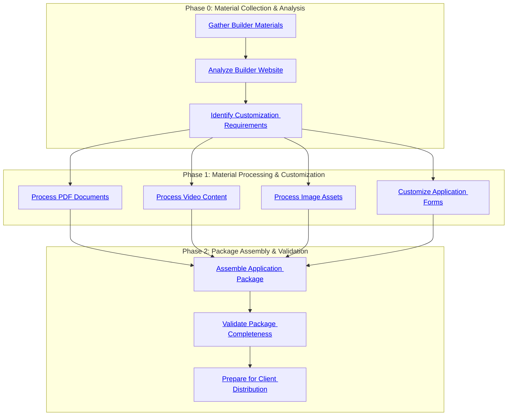

# Condo Application Package Creation Pipeline - Visual Progress

> This visualization follows the schema defined in [doc/pipeline/pipeline_visualization_schema.yaml](../../doc/pipeline/pipeline_visualization_schema.yaml).
> Generated from [pipeline_template.yaml](pipeline_template.yaml) following schema generation instructions.
> Icons, colors, and layout conform to visualization schema specifications.

**Project ID**: {{project_id}}
**Builder**: {{builder_name}}
**Project Name**: {{project_name}}
**Status**: ⏳ **NOT STARTED** - Waiting for Builder Materials
**Progress**: 0% Complete (0/8 units completed)
**Package Type**: {{package_type}}
**Target Timeline**: {{target_timeline}}
**Agent**: {{agent_name}}

---

## Visualization Configuration

Following `pipeline_visualization_schema.yaml`:

### Icons Configuration
- **Status Icons**: ⏳ PENDING, 🔄 IN_PROGRESS, ✅ COMPLETED, ❌ FAILED, ⏭️ SKIPPED, ⚠️ WITHDRAWN, 🚫 REJECTED
- **Highlight Icons**: ❗ critical, ❓ optional

### Color Scheme
- **Phase Color**: #0b5fff (blue)
- **Unit Color**: #0f9d58 (green)
- **Status Colors**:
  - PENDING: #f6c34a (yellow)
  - IN_PROGRESS: #2b7cff (blue)
  - COMPLETED: #2ecc71 (green)
  - FAILED: #e74c3c (red)
  - SKIPPED: #95a5a6 (gray)

### Synchronization Settings
- **Auto-sync**: Disabled - Manual updates required
- **Sync Fields**: id, name, status
- **Last Sync**: {{timestamp}}

---

## Pipeline Progress Visualization

**Click on phase links to jump to detailed task information**

Following `pipeline_visualization_schema.yaml` mermaid options:
- **Direction**: TD (Top-down)
- **Node Shapes**: Phase=rect, Unit=roundrect

---

## Enhanced Pipeline Features

### Material Processing Workflow
The pipeline supports comprehensive material processing for condo application packages:

- **Multi-format Support**: Handles PDFs, videos, images, and forms from builder directories
- **Website Integration**: Extracts additional information from builder websites
- **Customization Tracking**: Identifies and highlights all sections requiring agent information
- **Quality Validation**: Ensures package completeness before client distribution

### Workflow Patterns
- **Parallel Processing**: Phase 1 allows concurrent processing of different material types
- **Dependency Management**: Ensures customization requirements are identified before processing begins
- **Validation Gates**: Multiple checkpoints to ensure quality and completeness

### Integration Features
- **Builder Directory Integration**: Direct access to provided material directories
- **Website Scraping**: Automated extraction of project information from builder sites
- **Agent Branding**: Systematic insertion of agent contact information and branding
- **Client Distribution**: Professional packaging for client delivery

---

## Phase Details

### Phase 0: Material Collection & Analysis
**Status**: ⏳ PENDING | **Duration**: TBD | **Units**: 0/3 | **Progress**: 0%

#### Gather Builder Materials
- **ID**: `gather_builder_materials`
- **Status**: ⏳ PENDING
- **Duration**: TBD
- **Input**: builder_materials_directory
- **Output**: collected_materials_inventory, material_types_identified
- **Description**: Collect all materials from builder's provided directory including PDFs, videos, images, and forms
- **Dependencies**: None
- **Exit Conditions**: COMPLETED → Analyze Builder Website

#### Analyze Builder Website
- **ID**: `analyze_builder_website`
- **Status**: ⏳ PENDING
- **Duration**: TBD
- **Input**: builder_website_url
- **Output**: website_project_info, additional_materials_urls
- **Description**: Extract additional project information from builder's website including specifications, features, and requirements
- **Dependencies**: gather_builder_materials
- **Exit Conditions**: COMPLETED → Identify Customization Requirements

#### Identify Customization Requirements
- **ID**: `identify_customization_needs`
- **Status**: ⏳ PENDING
- **Duration**: TBD
- **Input**: collected_materials_inventory, website_project_info
- **Output**: customization_requirements, agent_info_placeholders
- **Description**: Analyze all materials to identify sections that need agent information customization
- **Dependencies**: analyze_builder_website
- **Exit Conditions**: COMPLETED → Process PDF Documents

### Phase 1: Material Processing & Customization
**Status**: ⏳ PENDING | **Duration**: TBD | **Units**: 0/4 | **Progress**: 0%

#### Process PDF Documents
- **ID**: `process_pdf_documents`
- **Status**: ⏳ PENDING
- **Duration**: TBD
- **Input**: collected_materials_inventory, customization_requirements
- **Output**: processed_pdfs, pdf_customization_highlights
- **Description**: Process and customize PDF documents with agent information and highlighting
- **Dependencies**: identify_customization_needs
- **Exit Conditions**: COMPLETED → Process Video Content

#### Process Video Content
- **ID**: `process_video_content`
- **Status**: ⏳ PENDING
- **Duration**: TBD
- **Input**: collected_materials_inventory
- **Output**: organized_videos, video_content_summary
- **Description**: Review and organize video content for inclusion in application package
- **Dependencies**: identify_customization_needs
- **Exit Conditions**: COMPLETED → Process Image Assets

#### Process Image Assets
- **ID**: `process_image_assets`
- **Status**: ⏳ PENDING
- **Duration**: TBD
- **Input**: collected_materials_inventory
- **Output**: optimized_images, image_gallery_structure
- **Description**: Organize and optimize image assets for the application package
- **Dependencies**: identify_customization_needs
- **Exit Conditions**: COMPLETED → Customize Application Forms

#### Customize Application Forms
- **ID**: `customize_application_forms`
- **Status**: ⏳ PENDING
- **Duration**: TBD
- **Input**: collected_materials_inventory, customization_requirements, agent_info_placeholders
- **Output**: customized_forms, form_completion_guide
- **Description**: Customize application forms with agent information and prepare for client use
- **Dependencies**: identify_customization_needs
- **Exit Conditions**: COMPLETED → Assemble Application Package

### Phase 2: Package Assembly & Validation
**Status**: ⏳ PENDING | **Duration**: TBD | **Units**: 0/3 | **Progress**: 0%

#### Assemble Application Package
- **ID**: `assemble_application_package`
- **Status**: ⏳ PENDING
- **Duration**: TBD
- **Input**: processed_pdfs, organized_videos, optimized_images, customized_forms, pdf_customization_highlights
- **Output**: final_application_package, package_manifest
- **Description**: Compile all processed materials into a comprehensive application package
- **Dependencies**: process_pdf_documents, process_video_content, process_image_assets, customize_application_forms
- **Exit Conditions**: COMPLETED → Validate Package Completeness

#### Validate Package Completeness
- **ID**: `validate_package_completeness`
- **Status**: ⏳ PENDING
- **Duration**: TBD
- **Input**: final_application_package, package_manifest, customization_requirements
- **Output**: validation_report, completeness_checklist
- **Description**: Verify all required materials are included and properly customized
- **Dependencies**: assemble_application_package
- **Exit Conditions**: COMPLETED → Prepare for Client Distribution

#### Prepare for Client Distribution
- **ID**: `prepare_client_distribution`
- **Status**: ⏳ PENDING
- **Duration**: TBD
- **Input**: final_application_package, validation_report
- **Output**: client_ready_package, distribution_readme
- **Description**: Final preparation and packaging for client delivery
- **Dependencies**: validate_package_completeness
- **Exit Conditions**: None (Terminal)

---

## Progress Summary

### Overall Progress
- **Total Units**: 8
- **Completed**: 0 (0%)
- **In Progress**: 0
- **Pending**: 8
- **Failed**: 0

### Phase Completion Status
- **Phase 0**: 0/3 units (0%)
- **Phase 1**: 0/4 units (0%)
- **Phase 2**: 0/3 units (0%)

### Key Milestones
- **Material Collection**: Not started
- **Processing Complete**: Not started
- **Package Assembled**: Not started
- **Validation Passed**: Not started
- **Client Ready**: Not started

---

## Project Information Summary

### Builder Details
- **Builder Name**: {{builder_name}}
- **Project Name**: {{project_name}}
- **Website**: {{builder_website_url}}
- **Material Directory**: {{materials_directory}}

### Package Specifications
- **Package Type**: {{package_type}}
- **Target Client**: {{target_client_type}}
- **Customization Level**: {{customization_level}}

### Agent Information
- **Agent Name**: {{agent_name}}
- **Contact Information**: {{agent_contact}}
- **Branding Requirements**: {{branding_requirements}}

### Current Status
- **Last Activity**: Pipeline initialized
- **Next Action**: Provide builder materials directory and website URL
- **Priority Level**: High (Time-sensitive client materials)

---

*Generated on {{timestamp}} | Template Version: 1.0.0 | Pipeline ID: condo-application-package*