# Royal Bayview Condo Application Package Pipeline - Progress Visualization

## Pipeline Overview
**Project**: Royal Bayview Application Package Generation
**Status**: Infrastructure Setup Complete
**Last Updated**: 2025-11-16

## Pipeline Flowchart (Top-Down Layout)

```mermaid
flowchart TD
    %% Infrastructure Setup Phase
    subgraph INFRA["🔧 Infrastructure Setup"]
        A1[setup_directory_structure<br/>✅ COMPLETED<br/>Created .checksum, tracking, planning dirs]
        A2[initialize_config_tracking<br/>⏳ PENDING<br/>Initialize config checksum tracking]
        A3[setup_progress_tracking<br/>⏳ PENDING<br/>Initialize progress tracking files]
    end

    %% Material Collection Phase
    subgraph MATERIAL["📊 Material Collection & Analysis"]
        B1[gather_website_content<br/>✅ COMPLETED<br/>Extracted Tridel Royal Bayview website data]
        B2[analyze_location_benefits<br/>⏳ PENDING<br/>Research golf course proximity benefits]
        B3[research_market_context<br/>⏳ PENDING<br/>Analyze Thornhill condo market trends]
    end

    %% Content Processing Phase
    subgraph CONTENT["⚙️ Content Processing & Customization"]
        C1[analyze_materials_and_propose_artifacts<br/>⏳ PENDING<br/>Analyze materials and create MD proposal]
        C2[create_project_summary<br/>⏳ PENDING<br/>Create compelling project summary]
        C3[generate_feature_highlights<br/>⏳ PENDING<br/>Generate detailed feature highlights]
        C4[prepare_client_questions<br/>⏳ PENDING<br/>Prepare comprehensive client questions]
        C5[convert_md_to_html_pdf<br/>⏳ PENDING<br/>Convert MD files to HTML/PDF]
        C6[organize_agent_presentation_materials<br/>⏳ PENDING<br/>Clean up and organize media files]
        C7[create_agent_instructions<br/>⏳ PENDING<br/>Create comprehensive agent instructions]
        C8[generate_agent_website<br/>⏳ PENDING<br/>Generate agent-centric website]
    end

    %% Language Processing Phase
    subgraph LANG["🌐 Language Processing & Translation"]
        D1[create_language_versions<br/>⏳ PENDING<br/>Generate English & Chinese content versions]
    end

    %% Package Assembly Phase
    subgraph ASSEMBLY["📦 Package Assembly & Validation"]
        E1[assemble_application_package<br/>⏳ PENDING<br/>Assemble multi-language application packages]
        E2[validate_package_completeness<br/>⏳ PENDING<br/>Validate all language packages]
        E3[prepare_client_distribution<br/>⏳ PENDING<br/>Prepare packages for client distribution]
    end

    %% Flow Connections
    A1 --> A2 --> A3
    A3 --> B1
    B1 --> B2
    B1 --> B3
    B2 --> C1
    B3 --> C1
    C1 --> C2
    C1 --> C3
    C1 --> C4
    C2 --> C5
    C3 --> C5
    C4 --> C5
    C1 --> C6
    C6 --> C7
    C7 --> C8
    C7 --> D1
    D1 --> E1
    E1 --> E2
    E2 --> E3

    %% Styling
    classDef completed fill:#d4edda,stroke:#155724,color:#155724
    classDef pending fill:#fff3cd,stroke:#856404,color:#856404
    classDef inprogress fill:#cce7ff,stroke:#004085,color:#004085

    class A1 completed
    class B1 completed
    class A2,A3,B2,B3,C1,C2,C3,C4,C5,C6,C7,C8,D1,E1,E2,E3 pending
```



## Phase Status Summary

### ✅ **Phase 0: Infrastructure Setup** - 33% Complete
- **setup_directory_structure**: ✅ COMPLETED
  - Created `.checksum/` directory for config tracking
  - Created `tracking/` directory for progress monitoring
  - Created `planning/` directory for intermediate artifacts
- **initialize_config_tracking**: ⏳ PENDING
- **setup_progress_tracking**: ⏳ PENDING

### ✅ **Phase 0.5: Material Collection & Analysis** - 33% Complete
- **gather_website_content**: ✅ COMPLETED
  - Successfully extracted comprehensive information from Tridel Royal Bayview website
  - Collected project overview, amenities, pricing, floor plans, and contact details
  - Downloaded media assets and marketing materials
- **analyze_location_benefits**: ⏳ PENDING
- **research_market_context**: ⏳ PENDING

### ⏳ **Phase 1: Content Processing & Customization** - 0% Complete
- **analyze_materials_and_propose_artifacts**: ⏳ PENDING
- **create_project_summary**: ⏳ PENDING
- **generate_feature_highlights**: ⏳ PENDING
- **prepare_client_questions**: ⏳ PENDING
- **convert_md_to_html_pdf**: ⏳ PENDING
- **organize_agent_presentation_materials**: ⏳ PENDING
- **create_agent_instructions**: ⏳ PENDING
- **generate_agent_website**: ⏳ PENDING

### ⏳ **Phase 1.5: Language Processing & Translation** - 0% Complete
- **create_language_versions**: ⏳ PENDING
  - Will generate English and Chinese versions of all content
  - Maintain professional real estate terminology
  - Preserve Tridel branding across languages

### ⏳ **Phase 2: Package Assembly & Validation** - 0% Complete
- **assemble_application_package**: ⏳ PENDING
- **validate_package_completeness**: ⏳ PENDING
- **prepare_client_distribution**: ⏳ PENDING

## Key Dependencies & Blockers

### Current Blockers
1. **Config Checksum Tracking**: Must complete `initialize_config_tracking` before proceeding
2. **Progress Monitoring**: Need `setup_progress_tracking` for pipeline visualization
3. **Material Analysis**: Location benefits and market context analysis required for content creation

### Critical Path
```
Infrastructure Setup → Material Collection → Content Processing → Language Processing → Package Assembly
```

## Next Steps
1. Complete infrastructure setup (config tracking and progress monitoring)
2. Finish material analysis (location benefits and market research)
3. Begin content processing pipeline
4. Implement multi-language support
5. Assemble and validate final packages

## Configuration Status
- **Languages**: English (en), Chinese (zh)
- **Agent**: Sarah Gu (Brokerage: Real Estate Brokerage, Contact: sarah.gu@email.com)
- **Project**: Tridel Royal Bayview Residences, Thornhill, ON
- **Contact**: 416.661.7699

---
*Auto-generated pipeline visualization - Last updated: 2025-11-16*